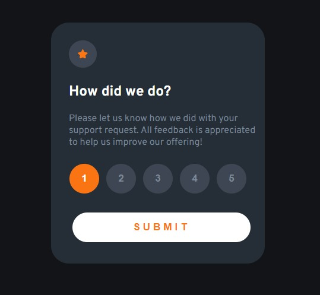

<h1 align="center">Componente Interativo</h1>

A Frontend Mentor challenge to practive basic knowledge of HTML, CSS and JavaScript

  <a href="#-tecnologias">Tecnologias</a>&nbsp;&nbsp;&nbsp;|&nbsp;&nbsp;&nbsp;
  <a href="#-projeto">Projeto</a>&nbsp;&nbsp;&nbsp;|&nbsp;&nbsp;&nbsp;
  <a href="#-layout">Layout</a>&nbsp;&nbsp;&nbsp;|&nbsp;&nbsp;&nbsp;
  <a href="#memo-licença">Licença</a>

 

    

 

## 🚀 Tecnologias

- HTML e CSS
- JavaScript
- Git e Github
- Paint

 

## 💻 Projeto
This is an interactive component where you can place your rating from 1 to 5

 

Coded by &copy;João Victor 2023
